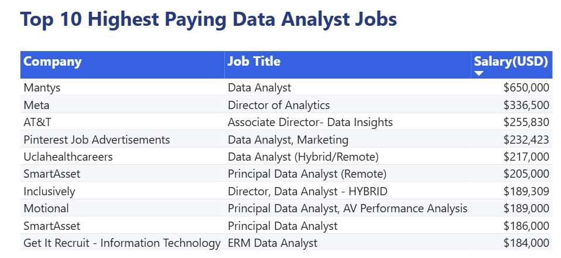
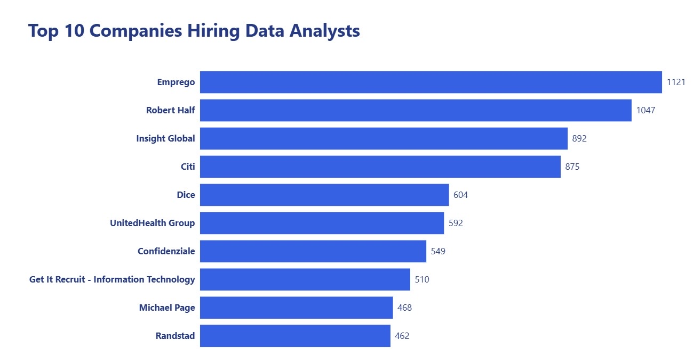
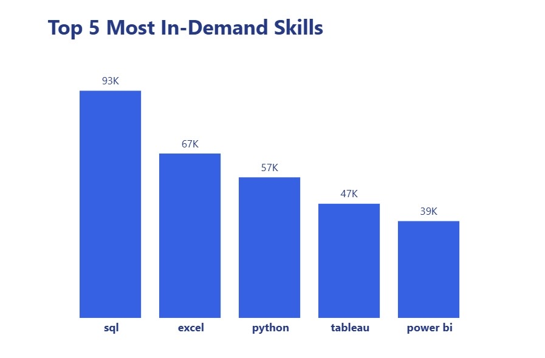
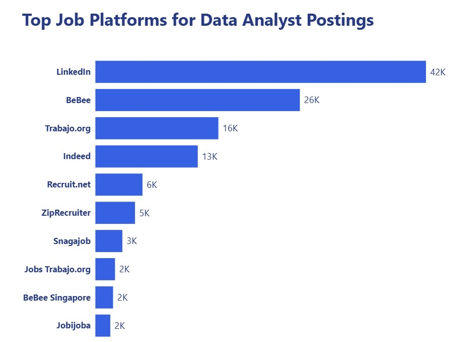
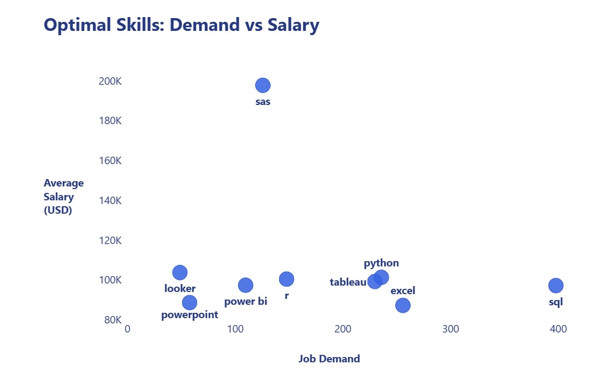

# SQL Data Analyst Job Market Analysis

## 📑 Table of Contents

- [📌 Introduction](#-introduction)
- [🛠 Tools Used](#-tools-used)
- [📊 Power BI Dashboard](#-power-bi-dashboard)
- [📊 SQL Analysis](#-sql-analysis)
  - [Query 1 – Top Paying Data Analyst Jobs](#query-1--top-paying-data-analyst-jobs)
  - [Query 2 – Top Companies Hiring Data Analysts](#query-2--top-companies-hiring-data-analyst-jobs)
  - [Query 3 – Most In-Demand Skills](#query-3--most-in-demand-skills)
  - [Query 4 – Top Job Platforms](#query-4--top-job-platforms)
  - [Query 5 – Optimal Skills: Demand vs Salary](#query-5--optimal-skills-demand-vs-salary)
- [📈 Conclusions](#-conclusions)
- [📂 Project Structure](#-project-structure)

---

## 📌 Introduction

This project analyzes the Data Analyst job market using SQL and Power BI. The analysis is based on real-world job posting data and answers five practical business questions related to salaries, hiring demand, technical skills, and job posting platforms.

SQL was used to extract and analyze the data, while Power BI was used to transform the query results into interactive dashboards for data visualization.

---

## 🛠 Tools Used

- **PostgreSQL** – Database management
- **SQL** – Data querying and analysis
- **Power BI** – Dashboard development and visualization
- **Visual Studio Code** – SQL development
- **Git & GitHub** – Version control and project documentation

---

## 📊 Power BI Dashboard

The SQL query results were imported into Power BI to create interactive dashboards. Each visualization highlights a different aspect of the Data Analyst job market and helps present the analysis in a clear and intuitive way.

The complete Power BI dashboard is included in this repository.

---

# 📊 SQL Analysis

---

## Query 1 – Top Paying Data Analyst Jobs

### Business Question

Which Data Analyst jobs offer the highest annual salaries?

### SQL File

[1_top_paying_jobs.sql](project_sql/1_top_paying_jobs.sql)

### Dashboard



### Key Insights

- The highest-paying Data Analyst position offers an annual salary above **$650,000**.
- The highest-paying opportunities are concentrated among a relatively small number of companies.

---

## Query 2 – Top Companies Hiring Data Analysts

### Business Question

Which companies publish the largest number of Data Analyst job postings?

### SQL File

[2_top_hiring_companies.sql](project_sql/2_top_hiring_companies.sql)

### Dashboard



### Key Insights

- A small number of companies publish a large share of Data Analyst job postings.
- Companies with high hiring volumes may provide more employment opportunities.
- Both recruiting agencies and large organizations appear among the most active employers.

---

## Query 3 – Most In-Demand Skills

### Business Question

Which skills appear most frequently in Data Analyst job postings?

### SQL File

[3_top_demanded_skills.sql](project_sql/3_top_demanded_skills.sql)

### Dashboard



### Key Insights

- SQL is the most frequently requested technical skill.
- Excel and Python remain essential skills for Data Analysts.
- Tableau and Power BI are widely used visualization tools.

---

## Query 4 – Top Job Platforms

### Business Question

Which job platforms publish the most Data Analyst job postings?

### SQL File

[4_top_job_platforms.sql](project_sql/4_top_job_platforms.sql)

### Dashboard



### Key Insights

- LinkedIn contains the largest number of Data Analyst job postings.
- BeBee and Trabajo.org also contribute a significant number of opportunities.
- Data Analyst positions are distributed across multiple recruitment platforms.

---

## Query 5 – Optimal Skills: Demand vs Salary

### Business Question

Which skills offer the best combination of high demand and high average salaries for Data Analysts?

### SQL File

[5_optimal_skills.sql](project_sql/5_optimal_skills.sql)

### Dashboard



### Key Insights

- SQL combines the highest demand with competitive average salaries.
- Python and Tableau provide an excellent balance between market demand and salary.
- SQL Server offers a competitive average salary despite relatively lower demand.

---

# 📈 Conclusions

This project demonstrates how SQL and Power BI can be combined to analyze real-world Data Analyst job market data.

### Main Findings

- SQL is the most in-demand technical skill for Data Analysts.
- Python, Tableau, Power BI, and SQL Server remain valuable technical skills.
- A small number of companies account for a large share of Data Analyst hiring.
- LinkedIn is the leading platform for Data Analyst job postings.
- Both market demand and salary should be considered when selecting technical skills to learn.

---

# 📂 Project Structure

```text
sql_project/
│
├── project_sql/
│   ├── 1_top_paying_jobs.sql
│   ├── 2_top_hiring_companies.sql
│   ├── 3_top_demanded_skills.sql
│   ├── 4_top_job_platforms.sql
│   └── 5_optimal_skills.sql
│
├── query_results/
│   ├── 1_top_paying_jobs.csv
│   ├── 2_top_hiring_companies.csv
│   ├── 3_top_demanded_skills.csv
│   ├── 4_top_job_platforms.csv
│   └── 5_optimal_skills.csv
│
├── images/
│   ├── 1_top_paying_jobs.jpg
│   ├── 2_top_hiring_companies.jpg
│   ├── 3_top_demanded_skills.jpg
│   ├── 4_top_job_platforms.jpg
│   └── 5_optimal_skills.jpg
│
├── SQL_Data_Analyst_Dashboard.pbix
│
└── README.md
```

---

# 👤 Author

**Mingyu Yang**

GitHub: https://github.com/mingyuuuuuuu